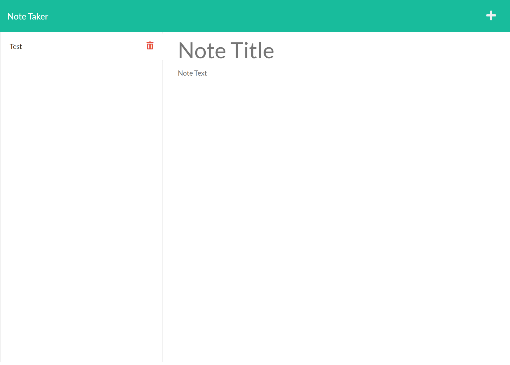

  # Note Taker 

  ## Description
  Need a simple and attractive way to keep notes? This project allows you to quickly add a new note with a title and text to keep track of your tasks. It also allows deleting a note when it's no longer needed.
  

  ## Table of Contents
  [Description](#description)  
  [Table of Contents](#table-of-contents)  
  [Installation](#installation)  
  [Usage](#usage)  
  [License](#license)  
  [Contributing](#contributing)  
  [Tests](#tests)  
  [Questions](#questions)

  ## Installation
  Download the source code and deploy it to the local server or a third party server system.

  ## Usage
  Use this project to create and delete notes.  
  Heroku Deployment: <https://evening-escarpment-69766.herokuapp.com/>

  ## License
  The below license covers this application. Please review before modifying for your own work.  
  There are no licenses associated with this project.

  ## Contributing
  This project was completed with help from:  
  uniqid, UW Coding Bootcamp

  ## Tests
  NA

  ## Questions
  Please direct any comments or inquiries using the resources below:  
  GitHub: [michaelsamm](https://github.com/michaelsamm)  
  Email: <msamm93@gmail.com>